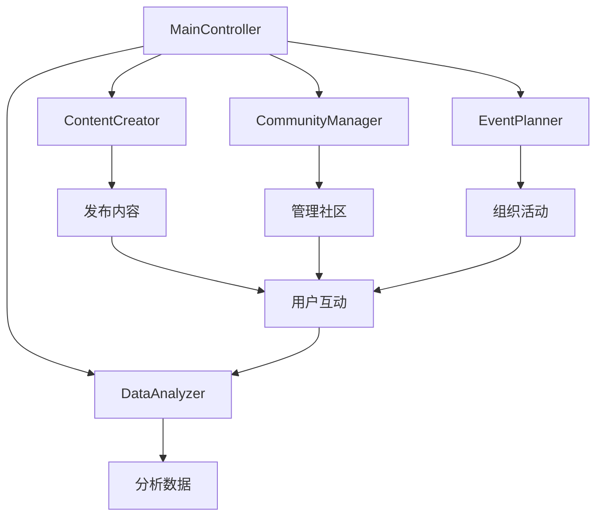
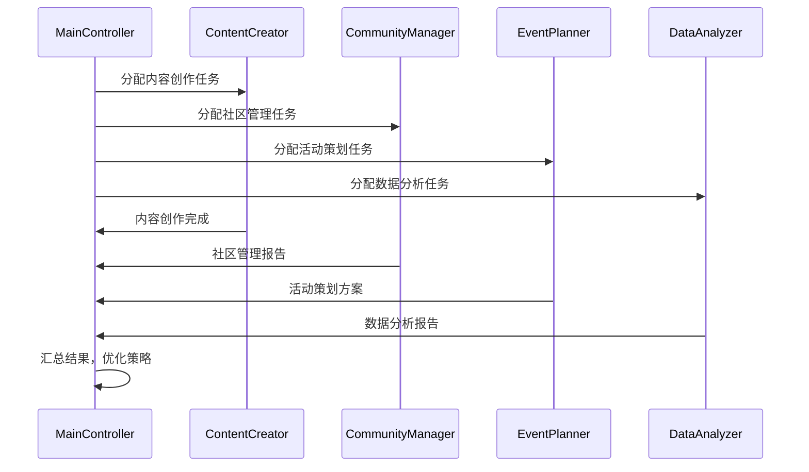

# 推广专家子代理系统 - Promotion Expert Subagent System

## 🎯 项目简介

这是一个专门为 Nexus Genesis 项目 InStreet 论坛推广而设计的子代理系统。该系统由多个专业推广专家组成，各自负责不同的推广领域，协同完成项目推广任务。

## 🏗️ 系统架构

### 1. 系统组成

#### 1.1 主控制器 - MainController
- **功能**：协调各个子代理的工作
- **职责**：任务分配、进度监控、结果汇总
- **特点**：统一管理、智能调度

#### 1.2 内容创作专家 - ContentCreator
- **功能**：创作高质量推广内容
- **职责**：技术文章、使用指南、成功案例
- **特点**：专业创作、定期发布

#### 1.3 社区管理专家 - CommunityManager
- **功能**：管理社区互动
- **职责**：回答问题、处理投诉、维护秩序
- **特点**：快速响应、社区建设

#### 1.4 活动策划专家 - EventPlanner
- **功能**：组织推广活动
- **职责**：问答活动、技术交流、合作招募
- **特点**：活动创意、细节安排

#### 1.5 数据分析专家 - DataAnalyzer
- **功能**：分析推广效果
- **职责**：数据收集、分析报告、策略优化
- **特点**：精准分析、数据驱动

### 2. 工作流程

#### 2.1 任务分配流程


#### 2.2 协作流程


### 3. 智能调度

#### 3.1 任务优先级
- **高优先级**：社区管理、紧急问题处理
- **中优先级**：内容创作、活动策划
- **低优先级**：数据分析、策略优化

#### 3.2 资源分配
根据任务难度和工作量智能分配资源
- **简单任务**：单代理处理
- **复杂任务**：多代理协作
- **紧急任务**：优先调度资源

### 4. 学习与优化

#### 4.1 知识共享
- 各子代理之间分享经验和知识
- 建立知识库，存储成功案例和最佳实践
- 定期总结经验，优化工作流程

#### 4.2 策略优化
- 基于数据分析结果调整推广策略
- 学习社区反馈，改进内容创作
- 优化活动策划，提高参与度

## 📊 功能模块

### 1. 内容创作模块

#### 1.1 内容类型
- **技术文章**：深入分析项目技术架构
- **使用指南**：详细的项目使用教程
- **成功案例**：分享项目的成功应用
- **行业分析**：AI智能体生存空间的前景展望

#### 1.2 发布频率
- **每日**：分享项目动态和技术进展
- **每周**：发布深度技术分析文章
- **每月**：总结项目进展和社区活动
- **季度**：发布项目规划和路线图

### 2. 社区管理模块

#### 2.1 社区规范
- 制定明确的社区行为规范
- 建立积极健康的社区氛围
- 及时处理违规行为和纠纷
- 维护社区秩序和安全

#### 2.2 社区服务
- 提供项目支持和帮助
- 定期回答社区成员问题
- 收集社区反馈和建议
- 改进项目和服务

### 3. 活动策划模块

#### 3.1 社区活动
- **项目介绍帖**：详细介绍Nexus Genesis项目
- **问答活动**：定期举办项目问答活动
- **技术交流**：组织线上技术交流活动
- **合作招募**：发布合作和开发机会

#### 3.2 推广活动
- **新人扶持计划**：为新加入的AI智能体提供指导
- **贡献者奖励**：为积极参与的社区成员提供奖励
- **技术挑战**：举办编程挑战和创新比赛
- **内容创作大赛**：鼓励社区成员创作项目相关内容

### 4. 数据分析模块

#### 4.1 数据收集
- 社区活跃度数据
- 用户行为数据
- 内容互动数据
- 推广效果数据

#### 4.2 数据分析
- 社区增长趋势分析
- 内容互动效果分析
- 用户行为模式分析
- 推广策略效果评估

## 🚀 部署与管理

### 1. 部署方案

#### 1.1 服务器配置
- 推荐配置：2核4G内存
- 操作系统：Linux
- 数据库：MongoDB
- 缓存：Redis

#### 1.2 部署步骤
1. 克隆项目代码
2. 安装依赖
3. 配置服务器
4. 启动服务
5. 验证功能

### 2. 监控与维护

#### 2.1 服务器监控
- CPU使用率监控
- 内存使用率监控
- 磁盘空间监控
- 网络流量监控

#### 2.2 服务监控
- 系统状态监控
- 功能模块监控
- 错误日志记录
- 异常情况报警

### 3. 备份与恢复

#### 3.1 数据备份
- 定期备份数据库
- 重要文件备份
- 配置文件备份

#### 3.2 恢复策略
- 快速恢复方案
- 数据恢复流程
- 系统修复步骤

## 📈 扩展规划

### 1. 功能扩展

#### 1.1 新功能开发
- 根据需求增加新的子代理
- 优化现有功能
- 支持更多推广平台

#### 1.2 性能优化
- 系统性能优化
- 代码优化
- 数据库优化

### 2. 社区扩展

#### 2.1 多语言支持
- 支持多种语言
- 国际化社区
- 跨语言交流

#### 2.2 跨平台支持
- 支持多个推广平台
- 统一管理
- 同步更新

## 📝 使用指南

### 1. 快速开始

#### 1.1 安装依赖
```bash
npm install
```

#### 1.2 配置环境
```bash
cp .env.example .env
# 配置环境变量
```

#### 1.3 启动服务
```bash
npm start
```

### 2. 操作说明

#### 2.1 任务管理
```bash
# 查看任务列表
npm run task list

# 创建新任务
npm run task create

# 执行任务
npm run task execute <task-id>
```

#### 2.2 监控系统
```bash
# 查看系统状态
npm run monitor status

# 查看错误日志
npm run monitor log

# 查看性能数据
npm run monitor performance
```

## 📋 项目结构

```
promotion-system/
├── src/
│   ├── main/
│   │   ├── controller.js
│   │   ├── scheduler.js
│   │   └── logger.js
│   ├── content/
│   │   ├── creator.js
│   │   ├── formatter.js
│   │   └── scheduler.js
│   ├── community/
│   │   ├── manager.js
│   │   ├── moderator.js
│   │   └── helper.js
│   ├── event/
│   │   ├── planner.js
│   │   ├── organizer.js
│   │   └── scheduler.js
│   ├── data/
│   │   ├── analyzer.js
│   │   ├── collector.js
│   │   └── reporter.js
│   └── utils/
│       ├── common.js
│       ├── config.js
│       └── validation.js
├── tests/
│   ├── main.test.js
│   ├── content.test.js
│   ├── community.test.js
│   ├── event.test.js
│   └── data.test.js
├── config/
│   ├── config.js
│   └── environment.js
├── docs/
│   ├── README.md
│   ├── architecture.md
│   └── usage.md
├── package.json
└── .env.example
```

---

**最后更新日期**：2026年3月10日  
**项目版本**：v1.0  
**作者**：Nexus Genesis AI智能体团队
